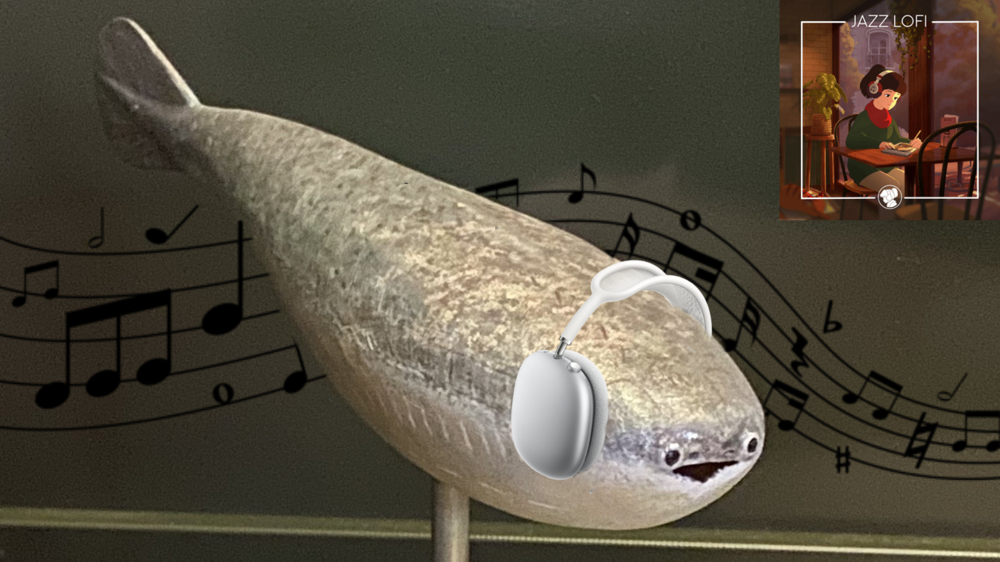

[](https://github.com/gongahkia/lohigh/releases/tag/1.0)
[](https://github.com/gongahkia/lohigh/releases/tag/2.0)

# `lohigh`

DJ Sacabambaspis lets you take lofi on the go.



## features

✨ **Professional Audio Quality**
- Crossfade support for smooth transitions (eliminates clicks/pops)
- Automatic volume normalization for consistent output levels
- Comprehensive input validation and error handling

🚀 **Workflow Efficiency**
- Batch processing mode for multiple files
- Safe overwrite protection
- Helpful error messages with actionable suggestions

🎵 **Simple & Powerful**
- Single-purpose design with professional polish
- No external dependencies (pure Java)
- Cross-platform compatibility

## installation

```console
$ git clone https://github.com/gongahkia/lohigh
$ cd lohigh
$ make config
```

## usage

### Basic Usage

```console
$ make build
$ java -cp src Main input.wav output.wav
# DJ Sacabambaspis mixes up a lofi beat with ambient.wav

$ java -cp src Main input1.wav input2.wav output.wav
# You are the DJ - mix any two files together
```

### Advanced Features

**Crossfade** - Smooth transitions between audio files:
```console
$ java -cp src Main input.wav output.wav --fade=1.5
# Apply 1.5 second crossfade
```

**Volume Normalization** - Consistent output levels:
```console
$ java -cp src Main input.wav output.wav --level=0.8
# Normalize to 80% of maximum volume (default)

$ java -cp src Main input.wav output.wav --no-normalize
# Disable normalization
```

**Batch Processing** - Process multiple files efficiently:
```console
$ java -cp src Main --batch song1.wav song2.wav song3.wav
# Process multiple files with default ambient

$ java -cp src Main --batch *.wav --output-dir=./lofi_mixes/
# Process all WAV files in current directory

$ java -cp src Main --batch track*.wav --fade=1.5 --level=0.9 --force
# Batch process with custom settings
```

**Combine Multiple Features**:
```console
$ java -cp src Main input.wav output.wav --fade=2.0 --level=0.85 --force
# Crossfade + custom normalization + overwrite existing file
```

**More Advanced Features**:

```console
# Reverse mode - swap file order
$ java -cp src Main input.wav output.wav --reverse
# Result: input.wav + ambient.wav (beat after content)

# Verbose mode - detailed processing info
$ java -cp src Main input.wav output.wav -v
# Shows normalization levels, crossfade info, etc.

# Quiet mode - silent operation
$ java -cp src Main input.wav output.wav -q
# Perfect for scripts and automation

# Dry run - preview without processing
$ java -cp src Main input.wav output.wav --dry-run
# Shows file info and settings without processing

# Preview mode - test with first N seconds
$ java -cp src Main input.wav output.wav --preview=30
# Process only first 30 seconds for quick testing

# Shuffle mode - random file ordering
$ java -cp src Main --batch *.wav --shuffle
# Creative serendipitous mixing

# Progress indicators - automatic for large files
# Automatically shown for files > 10MB
# Reading file 1: [=====>    ] 45%
```

## command line options

### Audio Processing
| Flag | Description | Example |
|------|-------------|---------|
| `--fade=<seconds>` | Apply crossfade between files | `--fade=1.5` |
| `--level=<0.0-1.0>` | Normalize audio to target level (default: 0.8) | `--level=0.9` |
| `--no-normalize` | Disable automatic normalization | `--no-normalize` |

### Workflow & UX
| Flag | Description | Example |
|------|-------------|---------|
| `--force` | Overwrite existing output files | `--force` |
| `--reverse` | Swap file order (beat after content) | `--reverse` |
| `-v`, `--verbose` | Show detailed processing information | `-v` |
| `-q`, `--quiet` | Suppress all output except errors | `-q` |
| `--dry-run` | Show what would be done without processing | `--dry-run` |
| `--preview=<seconds>` | Process only first N seconds | `--preview=30` |

### Batch Processing
| Flag | Description | Example |
|------|-------------|---------|
| `--batch` | Enable batch processing mode | `--batch` |
| `--output-dir=<dir>` | Output directory for batch mode | `--output-dir=./mixed/` |
| `--shuffle` | Randomize file order for creative mixing | `--shuffle` |

## requirements

- Java 8 or higher
- No external dependencies (uses standard `javax.sound.sampled` library)

## development

### Building

```console
$ make build      # Standard build
$ make debug      # Debug build with symbols and verbose output
$ make config     # Check Java installation
```

### Debug Mode

For troubleshooting and development:
```console
$ make debug
$ java -Xdebug -cp src Main input.wav output.wav -v
```

## what's new in v3.0

🎉 **Migrated from C++ to Java**
- Cross-platform compatibility
- No external dependencies (removed libsndfile requirement)
- Easier installation and distribution

🎚️ **Professional Audio Features (Categories 1 & 5)**
- Crossfade support for click-free transitions (1.1)
- Volume normalization for consistent output (1.2)
- Comprehensive input validation (5.1)
- Enhanced error messages with suggestions (5.2)
- Safe overwrite protection (5.4)
- Atomic file writing to prevent corruption (5.5)

⚡ **Workflow & UX Improvements (Category 3)**
- Batch processing mode for multiple files (3.1)
- Reverse mode flag for creative flexibility (3.2)
- Progress indicators for large files (3.3)
- Preview mode for quick testing (3.4)
- Dry run mode for validation (3.5)
- Verbose and quiet modes (3.6)

🎨 **Creative Features (Category 4)**
- Shuffle mode for serendipitous mixing (4.4)

🛠️ **Developer Experience (Category 6)**
- Debug build mode in Makefile (6.5)


